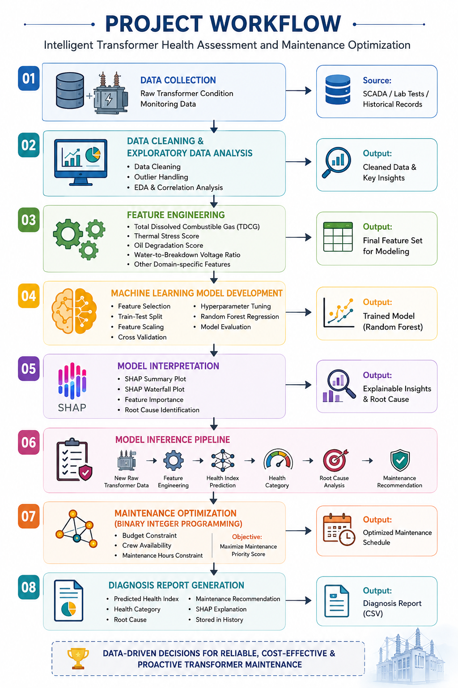

# Intelligent-Transformer-Health-Assessment
An end-to-end predictive maintenance framework for power transformers using Machine Learning, SHAP Explainability, and Binary Integer Programming for Health Index prediction, root cause analysis, maintenance recommendations, and maintenance optimization.
## Project Overview

Power transformers are critical assets in electrical power systems. Traditional maintenance strategies are often time-based or reactive, leading to unnecessary maintenance or unexpected failures.

This project develops an intelligent decision-support framework that:

- Predicts the **Transformer Health Index**
- Assigns a **Health Category**
- Identifies the **Root Cause** using SHAP Explainability
- Generates **Maintenance Recommendations**
- Optimizes maintenance planning using **Binary Integer Programming (BIP)**

The framework integrates Data Analytics, Machine Learning, Explainable AI, and Operations Research into a single predictive maintenance workflow.

## Key Features

- Data Cleaning & Preprocessing
- Exploratory Data Analysis (EDA)
- Domain-Specific Feature Engineering
- Random Forest Regression for Health Index Prediction
- SHAP Explainability for Model Interpretation
- Root Cause Analysis
- Automated Maintenance Recommendations
- Binary Integer Programming (BIP) for Maintenance Optimization
- Automated Diagnosis Report Generation

## Technology Stack

| Category | Tools & Libraries |
|----------|------------------|
| Programming | Python |
| Database | PostgreSQL |
| Data Processing | Pandas, NumPy |
| Machine Learning | Scikit-learn |
| Explainable AI | SHAP |
| Optimization | PuLP |
| Visualization | Matplotlib |
| Model Serialization | Joblib |

# Project Workflow

  

# Project Structure

Intelligent-Transformer-Health-Assessment/
│                                                                                                   
├── README.md                                                                                       
├── requirements.txt                                                                                
│                                                                                                   
├── Data/                                                                                           
│   ├── Health index.csv                                                                            
│   ├── Health_index_final.csv                                                                      
│   └── transformer_features_final.csv                                                              
│                                                                                                   
├── Models/                                                                                         
│   ├── RandomForest_HealthIndex.pkl                                                                
│   ├── scaler.pkl                                                                                  
│   └── model_features.pkl                                                                          
│                                                                                                   
├── Notebooks/                                                                                      
│   ├── 01_Data_Cleaning.ipynb                                                                      
│   ├── 02_EDA.ipynb                                                                                
│   ├── 03_Feature_Engineering.ipynb                                                                
│   ├── 04_Machine_Learning.ipynb                                                                   
│   ├── 05_Model_Inference.ipynb                                                                    
│   └── 06_Maintenance_Optimization.ipynb                                                           
│                                                                                                   
├── Output/                                                                                         
│   └── Transformer_Diagnosis_History.csv                                                           
│                                                                                                   
└── Images/

# Machine Learning Pipeline

The machine learning workflow consists of the following stages:

- Data Preparation
- Feature Selection
- Train-Test Split
- Feature Scaling
- Cross Validation
- Hyperparameter Tuning
- Model Evaluation
- Model Selection
- Final Model Testing
- Model Saving

The final selected model is **Random Forest Regression**, which demonstrated the best predictive performance for transformer Health Index prediction.

### Model Performance

  

  

# Explainable AI using SHAP

To improve model transparency, SHAP (SHapley Additive Explanations) was used to interpret every prediction.

The SHAP module provides:

- Global Feature Importance
- Local Prediction Explanation
- Root Cause Analysis
- Engineering Interpretation

### SHAP Summary Plot

  

### SHAP Waterfall Plot

  

# Maintenance Optimization

Transformer maintenance is optimized using **Binary Integer Programming (BIP)**.

The optimization considers:

- Maintenance Budget
- Maintenance Hours
- Crew Availability

The objective is to maximize maintenance priority while satisfying all operational constraints.

### Optimization Output

  

### Selected Transformers 

  

---

# Installation

## Clone the Repository

bash
git clone https://github.com/YOUR_USERNAME/Transformer-Health-Assessment.git

cd Transformer-Health-Assessment

## Install Required Libraries

bash
pip install -r requirements.txt

---

# Running with PostgreSQL (Original Implementation)

The project was originally developed using PostgreSQL.

Create a database named:

transformer_monitoring

Import the dataset:

transformer_features_final.csv

Update the database credentials inside the notebook before execution.

---

# Running without PostgreSQL (Recommended)

A CSV version of the processed dataset is included inside the **data** folder.

No database installation is required.

The notebooks can directly load:

data/transformer_features_final.csv

---

# How to Run the Project for a New Transformer

### Step 1

Open:

05_Model_Inference.ipynb

---

### Step 2

Locate the section:

python
# Raw Transformer Input

Replace the sample values with the measurements of your new transformer.

Example:

python
new_transformer = {

    "Hydrogen": 120,
    "Methane": 30,
    "Ethane": 18,
    "Ethylene": 22,
    "Acetylene": 1,
    "CO": 350,
    "CO2": 4500,
    "Oxygen": 15000,
    "Nitrogen": 50000,
    "Water content": 15,
    "Acidity": 0.08,
    "Interfacial V": 38,
    "Dielectric rigidity": 58,
    "Power factor": 0.42,
    "Resistivity": 20,
    "DBDS": 2

}

---

### Step 3

Run all notebook cells.

The system automatically performs:

- Feature Engineering
- Health Index Prediction
- Health Category Assignment
- SHAP Explainability
- Root Cause Analysis
- Maintenance Recommendation

---

### Step 4

The prediction is automatically appended to:

output/Transformer_Diagnosis_History.csv

Each prediction is stored as a new record without overwriting previous results.

---

# Sample Output

For every new transformer, the system generates:

- Predicted Health Index
- Health Category
- SHAP Explanation
- Root Cause Analysis
- Maintenance Recommendation
- Diagnosis Report (CSV)

### Sample Diagnosis Report

  

---

# Future Improvements

- Streamlit Web Application
- Real-Time IoT Integration
- SCADA Integration
- Power BI Dashboard
- Deep Learning Models
- Cloud Deployment
- Vehicle Routing Optimization
- Dynamic Maintenance Scheduling

---

# Author

**Shivam Sharma**

Master's in Operational Research  
University of Delhi

**Areas of Interest**

- Data Analytics
- Machine Learning
- Operations Research
- Explainable AI
- Predictive Maintenance
- Decision Support Systems
